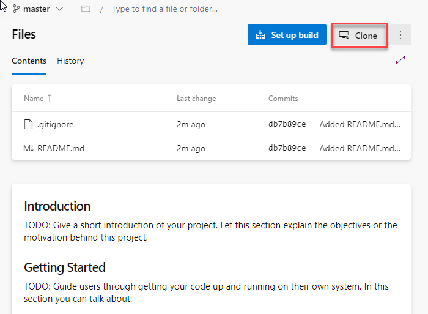
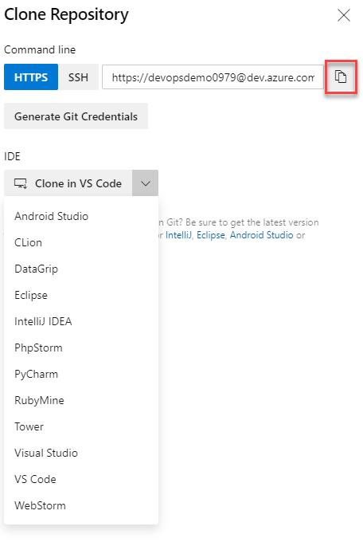
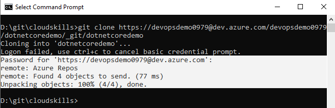
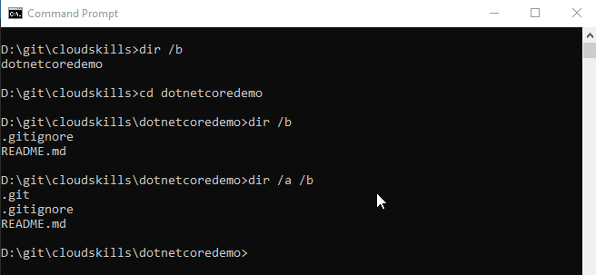
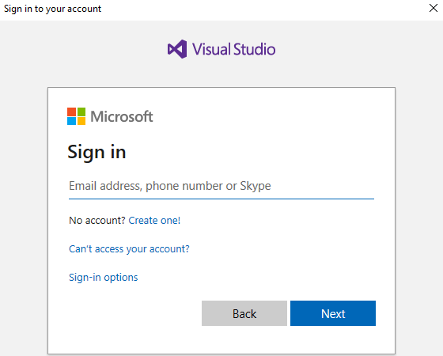
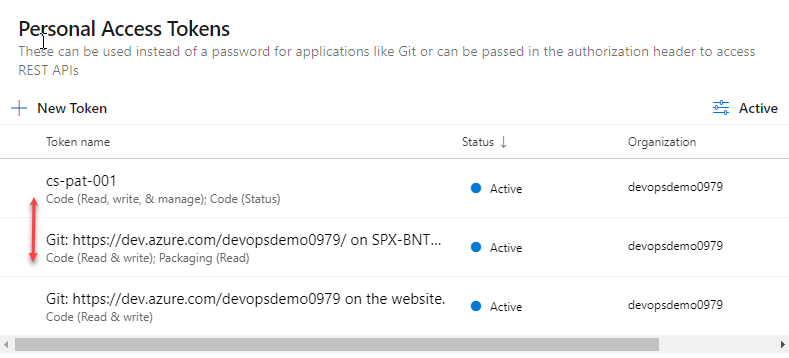
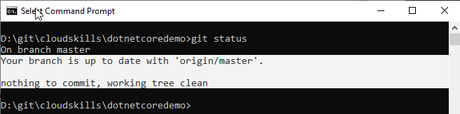

# Cloning the Azure Repository

In this step you'll look at _cloning_ a repository to create a local copy on your file system, enabling you

When working on code stored in a distributed system such as Git, which is the backend for an Azure DevOps Repo, you take a full copy of a repository by cloning the repository. This recreates the entire history of the repository locally on the users machine. Click **Clone** in the top right:

In the **IDE** section there is the option to **Clone in VS Code**, this will launch VSCode, prompt where to save the repository locally, and open VSCode session with the newly downloaded repository open as a folder in VSCode. Looking at the screen shot below, you can also see the same feature is available with other IDE's:

For this guide you are going to use Git on the command line, this will allow you to understand the mechanics of what each command is doing as it will not be hidden by an IDE. To do this click the copy button \(shown in red above\).

Open a command prompt locally, and `cd` to the directory you would like to clone the repository into. Type `git clone` at the prompt, this is the git command for cloning, and then paste in the URL copied from Clone Repository above, this instructs Git where to Clone the repository from: Hit return, and you will be prompted to enter a password. At the password prompt, paste in the Personal access token you saved earlier and hit return once more. If the credentials are correct, the Repo is cloned:

The highlighted section in white shows the password being accepted for the Repo and the four objects being cloned to the machine locally. You only created two files, a readme and .gitignore, why are there four objects:

If you list the contents of the directory structure using `dir /b` \(`ls` on Mac\), you can see the first object, the folder that contains the repository. `cd` into the repository folder and list the contents once more, the items listed are the second and third objects, the two files you created in the Azure DevOps portal. Altering the list command slightly to output all files and folders using `dir /a /b` \(`ls -al` on Mac\), the hidden .git directory is displayed. This is the forth object and is where Git tracks the local changes. Note on a Mac the .gitignore will not be displayed on listing the folder contents without `ls -al`, it is treated as a hidden file.

Note - the first time you connect to your repository on a windows OS you will be prompted to enter the credentials you sign into Azure DevOps with:

Once successfuly entered, the Git credential manager creates a Personal access token for you and caches it locally. You can view this by going back to the list of Personal access tokens in Azure DevOps:

You will see a third Personal access token, the name of which has been auto-generated based on the machine name Git generated it from. You also have default Scope, which may need to be edited.

You now have a locally cloned repository which has no changes from that on the server. You can check this using the `git status` command:

The highlighted section shows that there are no changes. Next you'll look at adding changes back to the locally cloned repository and then into the Azure Repo.

