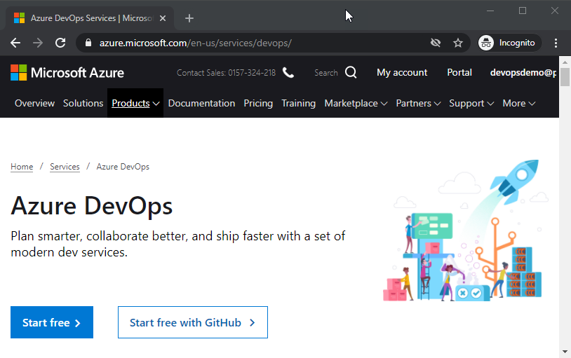
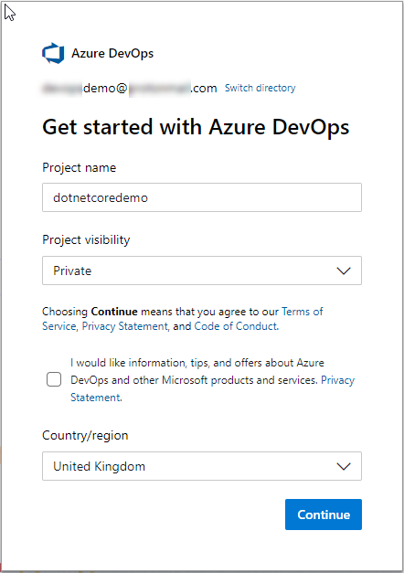
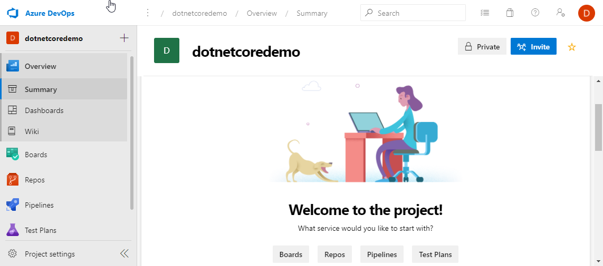

# Create an Project

 To setup a project, open a browser and navigate to [Azure DevOps](http://dev.azure.com/) and login the credentials which you used to create the Azure DevOps organisation in the prerequisites.

The option, Choose Start free with GitHub, is for teams already using source control in GitHub. In this guide you have no version controlled code and want the repositories to sit within Azure DevOps, so choose **Start free**.

Next enter a **Project name**, the main steps in this guide use dotnetcoredemo. For **Project visibility** choose to use a private project, this gives you control over who has access to you project. If you were running an open source project, this would be public. Last pick an appropriate **Country/region** for your locality.

The project is created and the project page for dotnetcoredemo is opened:

This is an empty project, the menu on the left shows the services, Boards, Repos, Pipelines and Test Plans. 

