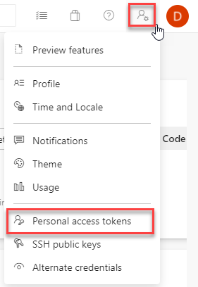
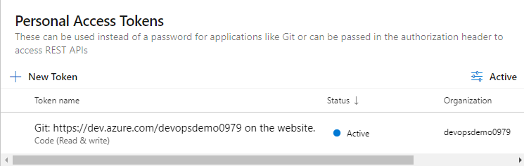
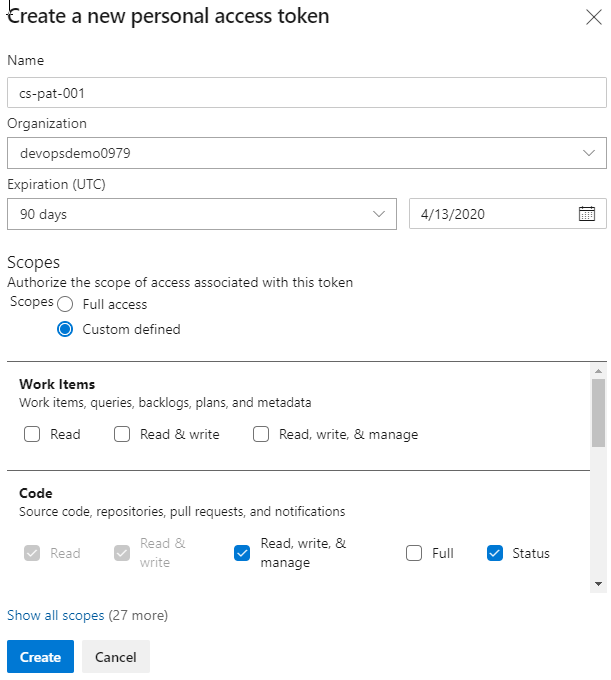
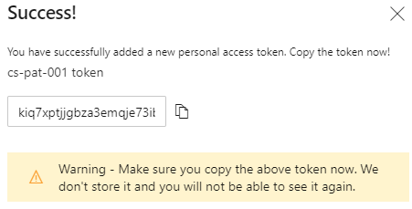
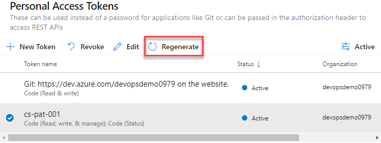

# Create Personal Access Token

To create a Personal Access Token, click to open the account settings menu which is top right, then choose **Personal access tokens**.

You can now see a list of all of your personal access tokens, as this was an empty organisation you will only see the default token created when the organisation was created. Click on **New Token**:

The form to create the Personal access token is displayed:

Working through the options, **Name** is the name of your Personal access token, it needs to be unique for your tokens. **Organization** is your Azure DevOps organisation, at the moment you have one. However, if the logged in user has been granted access to multiple organisations, you can choose "All accessible organizations" from this dropdown. **Scopes**, here you choose which services this Personal access token can work with. Select **Custom defined**, as you will want to be using the principal of least-privilege. Each [scope](https://docs.microsoft.com/en-us/azure/devops/integrate/get-started/authentication/oauth?view=azure-devops#scopes) maps to a set of permissions for one of the services you saw on the left when you entered Azure Devops for the first time. For this guide you want to work with code, to read and write from the repository, so choose **Read, write, & manage** and status from the **Code** section. Scroll up and down through the Scopes to get an idea of how a Personal access token can be tailored, leave all other scopes unchecked. Click **Create**.

Your Personal access token has been created and can be copied from the successful creation page. Note here the warning from Microsoft, once a Personal access token has been generated and this page closed, it cannot be recovered. Therefore, you must store this securely. If the token contents are lost, it can be regenerated. To regenerate a token, select the token in your Personal access token list and click regenerate:

The success screen is diplayed once more and the regenerated token can be copied.

If the token is compromised, it can be revoked, which removes the token from the PAT list.

You now have a Personal access token to access your Repo, so the next step is to start working with the Repo locally. Click **Azure DevOps** in the top left of the page to take you to your Azure DevOps Organisation home, choose the project that you created earlier, **dotnetcoredemo** and you are returned to the project page with the resources for the project listed in the menu on the left. Click **Repos** on this menu to enter the empty repository page. The repository is currently empty, you can choose initialise it with some common repository files.

