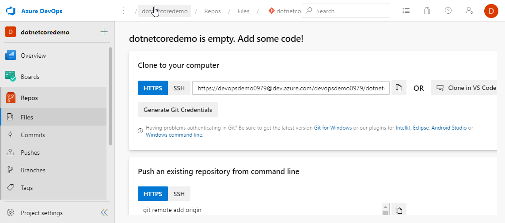
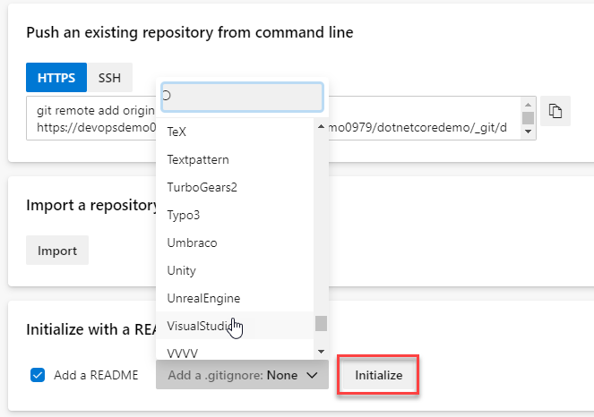

# Create Repository

A repository is a place to store version controlled code, enabling one or more developers to collaborate on the code, keeping a history of all changes. This is known as source control. You'll be adding a project which will automatically create a repository, this will enable you to add code and make changes to that code in further steps, simulating how an individual or team works with source control.

For this step you want to be working with a repository so choose **Repos**.

This is a view of an empty repository, to work with this repository locally, either from the command line or from a client, you will need to generate credentials. On this page you can see a button marked **Generate Git Credentials**, this will allow you to set a username and simple password to work with the repository. However it is not recommended, as these credentials have full access to the repository, along with other services and do not expire. The Microsoft Docs article [Authentication overview](https://docs.microsoft.com/en-gb/azure/devops/repos/Git/auth-overview?view=azure-devops) for Azure DevOps recommends to use a Personal Access token, where scope of access and an expiration date can be set.

 Click **Azure DevOps** in the top left of the page to take you to your Azure DevOps Organisation home, choose the project that you created earlier, **dotnetcoredemo** and you are returned to the project page with the resources for the project listed in the menu on the left. Click **Repos** on this menu to enter the empty repository page. The repository is currently empty, you can choose initialise it with some common repository files.

Scroll down to the bottom of the Repo page to the **Initialize with a README or gitignore** section. Ensure **Add a README** is checked, this will create a readme file at the root of the repository. Typicaly, a readme gives instructions on how to use the repository, a readme file is a [markdown](https://daringfireball.net/projects/markdown/) file. You will also want to add a .gitignore file, this file instructs git to ignore directories and file types that are required for your project, but should not be stored under source control in your repository. In this part of the guide we are going to use simple text files, but for an example of a working .gitignoe, we will setup the project for .NET, so use the dropdown to select **VisualStudio**. Click **Initialize**.

Your Repo is no longer empty, you can see the file list which now contains the readme and .gitignore. The readme is stored at the root of the Repo and is automatically displayed on the page as it is expected to contain instructions on how to use the Repo. Click on the .gitignore file to view an example of a setup for a software development project.

