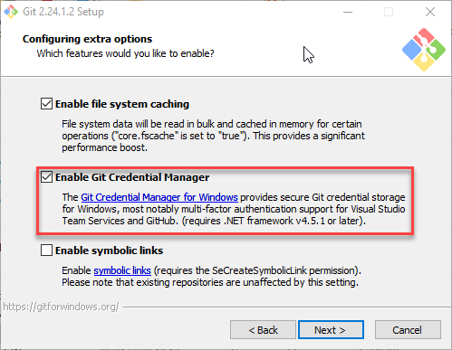
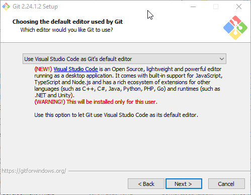

# Prerequisites

Before working through this guide you will need the following:

* An [Azure Subscription](https://azure.microsoft.com/en-us/), you can create a free account.
* An [Azure DevOps Organisation](http://dev.azure.com/), the basic plan starts with the first five users for free.
* A [GitHub](https://github.com/) account, sign up to the free plan, this gives you unlimited respositories.
* A local installation of [Visual Studio Code \(VSCode\)](https://code.visualstudio.com/download)
* A local installation of [Git](https://git-scm.com/), following the [install guide](https://git-scm.com/book/en/v2/Getting-Started-Installing-Git) for your OS. If you are using Windows, ensure the box is checked to **Enable Git Credential Manager**.

  

  If you installed VSCode before Git, you will also be presented with this option:

  

  This allows you to launch VSCode as the default code editor or difference tool, straight from git on the command line. Please leave as VSCode for this guide, you can reinstall later to pick a different IDE.

