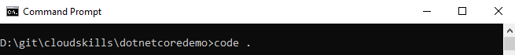
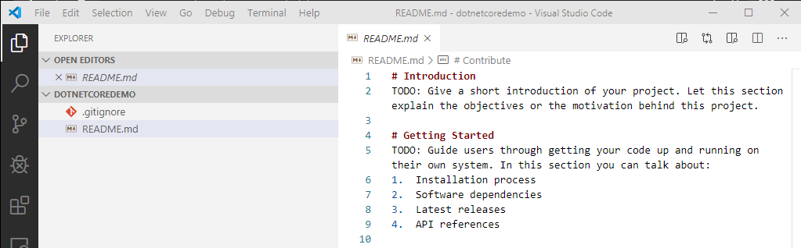
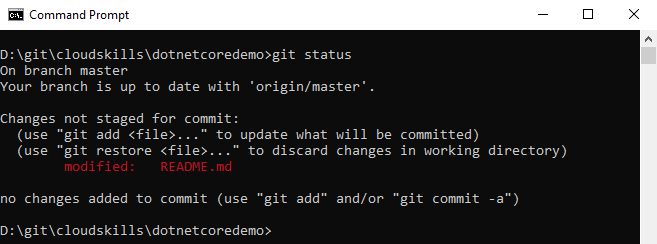
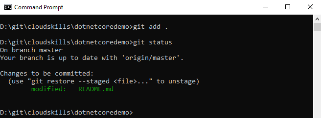
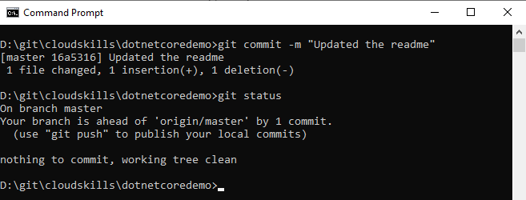
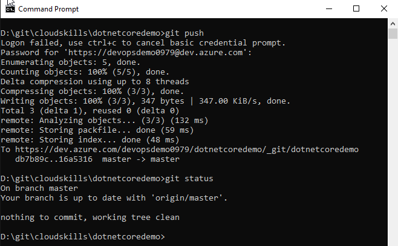
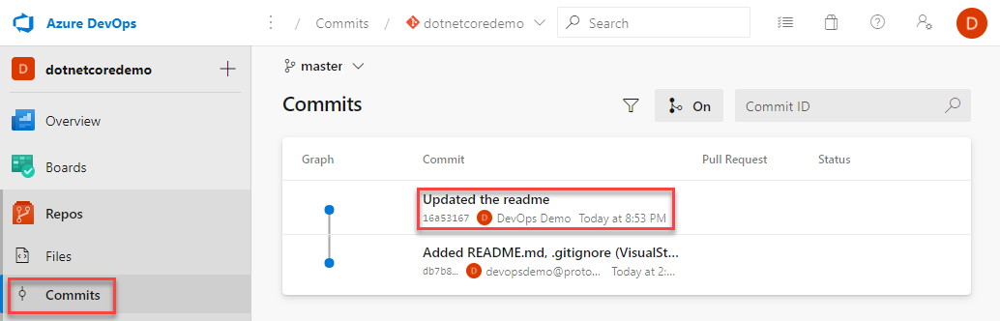
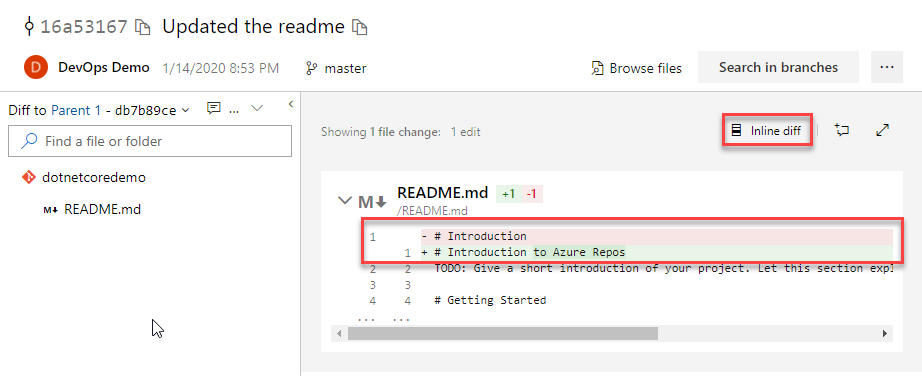
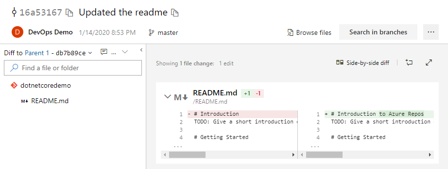

# Saving changes with commit and push

The process of committing saves your changes to the repository, tracking the changes and linking them to your credentials. It is best practice to group your commits into work items, such as a defect fix from issue tracking software, or a completed task from a sprint. This will keep the changes small, updating often, this will avoid conflicts when merging back with other changes. Until the point of commit, changes are not tracked in the repository, only on the local file system.

To see this in action you need to edit your local repository files, to do this you can launch VSCode from within the repository folder on the command line using the `code .` command:

VSCode opens with the dotnetcoredemo repository opened in the explorer view on the left hand side. Clicking on the readme.md opens the file in the editor:

Edit the header change the text to `# Introduction to Azure Repos` and save your changes. Switch back to the command prompt and run `git status` once more from within the dotnetcoredemo directory:

Git status has picked up that there is a modification to a tracked file on the file system and has displayed this, if there was more than one change, all changes would be listed here. At this point the repository is not tracking the listed changes, the notice that **Changes are not staged for commit**, indicates this is the case. To track the changes you first need to _stage_ the changes. For this you need to issue the `git add` command. You can stage a single file using it's filename with the `git add filename` command or if you have more than one change to stage, you can use a full stop `git add .`, to add all changes. If you now re-run `git status` :

The filename is now shown in green, it has been staged and is ready to be committed to the repository to be tracked locally. Issue the commit command `git commit -m "commit message"`, where the commit message describes the change, or details a work item such as a defect number:

The unique identifier for the commit is displayed first, along with a summary of what has changed. If you now issue a `git status` as shown above, you can see that your local repository is described as 1 commit ahead of the Repo is was cloned from, this is because you have commited one change since you checked out from the Azure DevOps Repo.

Your change has now been tracked locally, but you haven't updated the Repo to store the changes in Azure. To do this you need to use the `git push` command to push the commited changes from your local repository in to the Azure Repo:

You can see the git push command compressing the commited changes and pushing them to the Azure DevOps Repo. Once this process is complete, if you re-issue `git status`, the message **Your branch is up to date with 'origin/master'** indicates that the local and Azure DevOps Repo are back in synch.

Switch back to the Azure DevOps portal, this time click on **Commits** under the **Repos** menu item on the left hand side:

The Commits page shows the list of commits against this Repo, if you now click on the **Commit** text of the Updated the readme commit you can inspect the differences in the files between the two commits:

This view shows the original line 1, it is in red with the minus sign infront of it, and it's new text in green with the plus sign at the beginning. When there are multiple changes within a file, this view can be difficult to review, you can change this by clicking **Inline diff** to switch to the side by side view:

Next you will look at how to bring in committed changes from other users.

