# Working with GitHub

Azure DevOps Repos is just one of the Git backed source control systems where repositories can be stored remotely. GitHub is also a Git backed system, it was a forerunner to Azure DevOps Repos. GitHub is the industry standard collaboration platform for open source software projects, enabling developers to contribute to code repositories all over the world. In this Step you will look at working with GitHub repositories using Git.

Sign into GitHub with the credentials used to create the GitHub login in the prerequisites step:

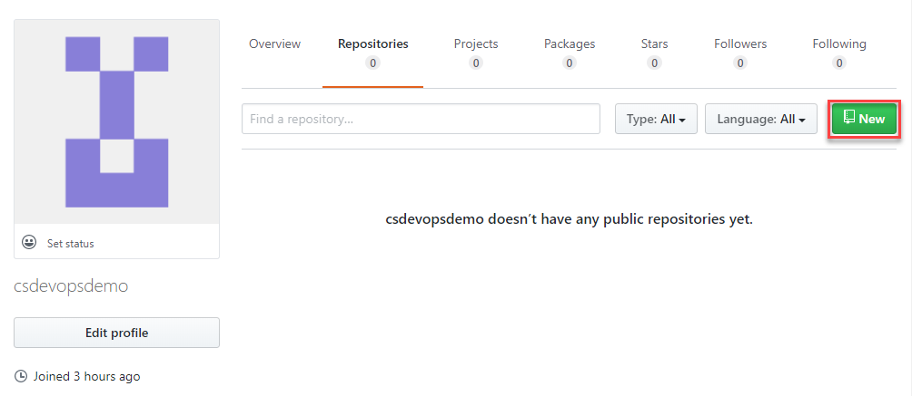

This is an empty project, there are no repositories in it yet. Click **New** top right to add a new repository:

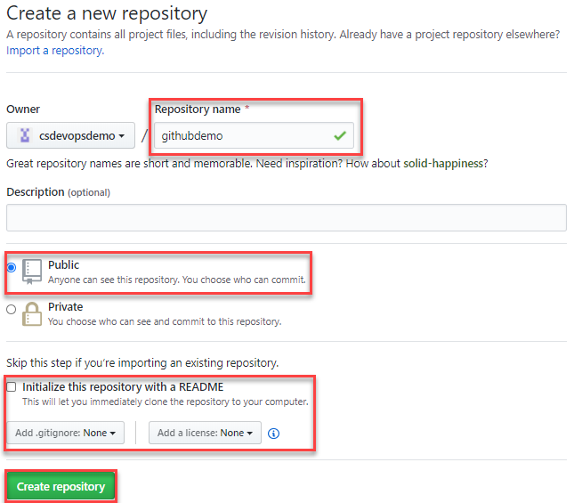

The content this page requires is the same as that of an Azure Repo. Enter a **Repository name**, leave the repository at it's default of **Public**, you can also initialise a README.md and a .gitignore. The extra dropdown allows you to choose an open source license for this repository, which is very common on GitHub. Click **Create repository**, the repository is created and the repository page is automatically loaded:

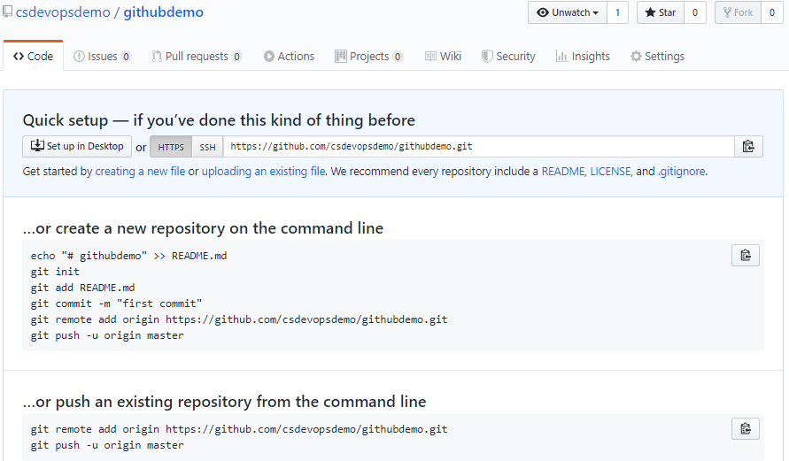

Scrolling down through the repository page, you can see git commands for creating a new repository or pushing a new repository from the command line. These commands are exactly the same as those for Azure DevOps, the difference is the address of the remote, which is pointing at your GitHub repo. To explore this start by initialising a local repository:

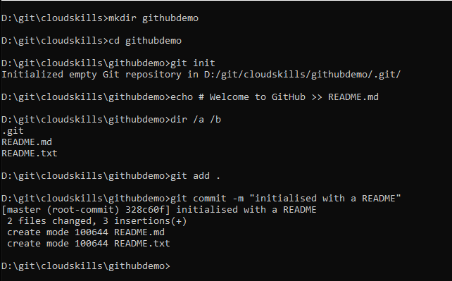

The commands used here are identical to that of Azure DevOps, first create an empty folder with `mkdir githubdemo` using the same name as the repo you created in GitHub. Next `cd` into the folder and initialise with `git init`. Use the `echo` command to quickly create a README with a single header `echo # Welcome to GitHub >> README.md` \(`echo "# Welcome to GitHub" >> README.md` on a Mac\). Execute `git add .` and `git commit -m "message"` to stage and commit your changes locally. You are now ready to push changes to the GitHub repository, however, even though it is a public repository, you still need permissions to access the repository. Switch back to the GitHUb repository in your browser, click on the profile icon in the top right, and click **Settings**:

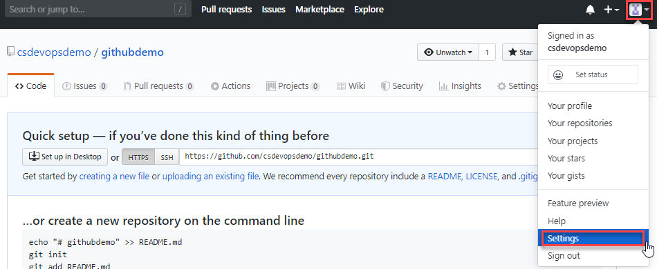

Scroll down to the bottom of the Settings menu and click **Developer settings**. In the left hand menu of the Developer settings page is **Personal access tokens**. GitHub uses a similar mechanism to grant access it's repositories as Azure DevOps. Click **Generate new token**:

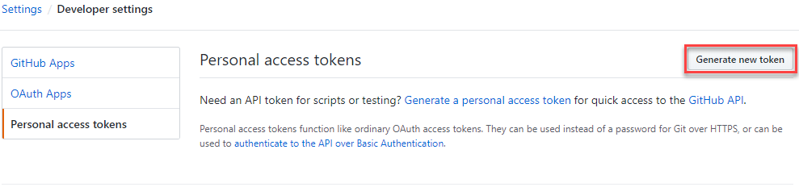

Once again you can see the similarity with Azure DevOps Repos. You need to enter a **Note** to say who the token is for and grant the **Scope**, in this case ticking **repo** to grant access to public and private repositories with this token.

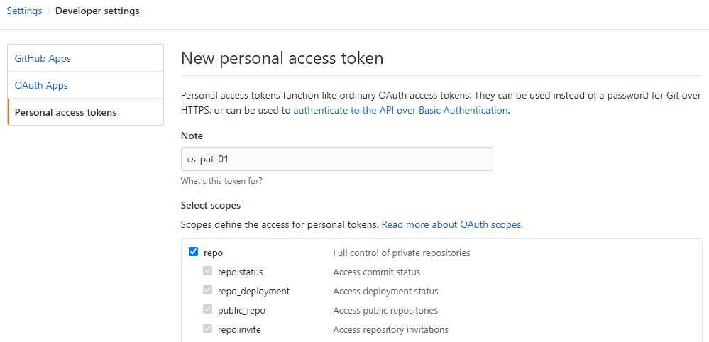

Scroll to the bottom of the page and click **Generate token**, to generate the token:

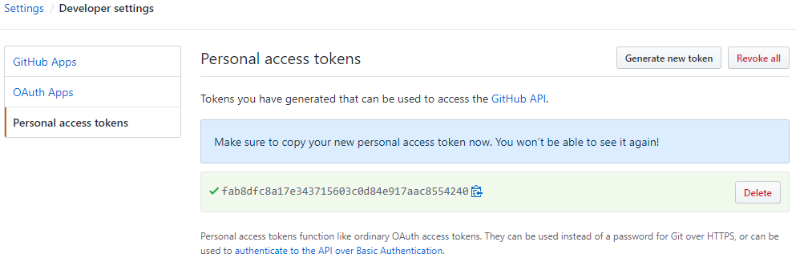

The generated token page warms you that you must make a copy, as the token cannot be recovered. Once you have taken a copy of the token, navigate back to the repo page and take a copy of the first command for **…or push an existing repository from the command line\***. Switch back to your terminal window and execute this command inside the folder where the `git init` was run and README.md file created. This creates a remote called origin which points at your GitHub remote. Now you can execute a `git push origin master` to push the local master branch to your remote:

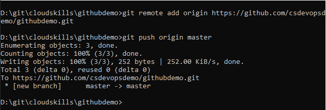

Note - on a Windows OS you will be promted for your github credentials, when the page is displayed enter your username and password as if you were logging into GitHub on your browser:

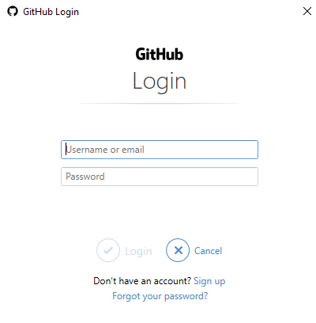

Once you've entered the credentials, if you switch back to GitHub in your browser and navigate back to the Personal access token page, you'll see that entering the credentials has created it's own Personal access token, setting a scope of Repo and Gist:

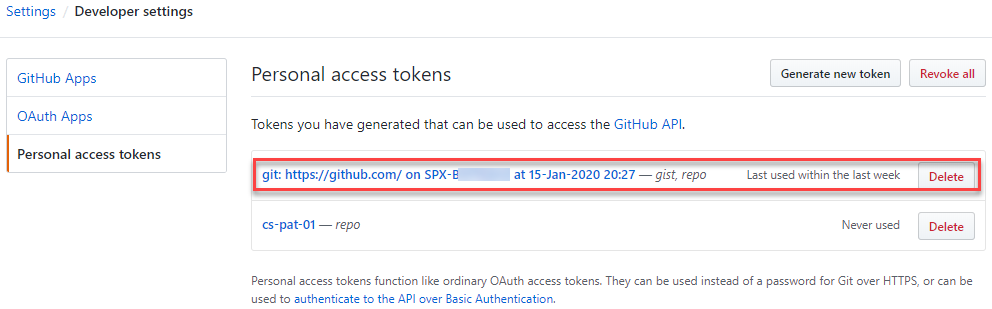

This will only happen on Windows. On a Mac you will be prompted for your username, and then a password. At the password prompt you must enter the Person Access token that you generated.

Once you have your changes pushed up, switch to the repository view in GitHub in your browser to check the changes have pushed successfully:

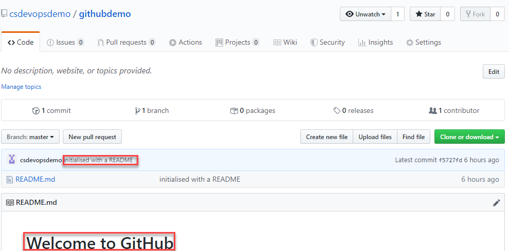

The commit message entered is displayed against the commit, and the test added to the markdown can be seen within the README.md

